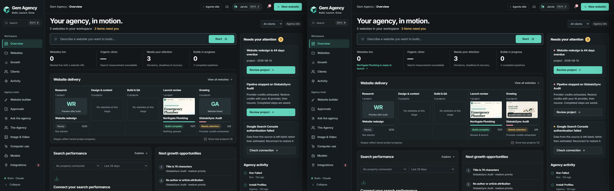

# Gem Agency

A local AI agency dashboard. You describe a website idea. Gem Agency researches it, designs and builds it, checks it, hands it to you for review and launch, then keeps working on its search traffic.

It runs on your own machine: a Python server, a SQLite database and a browser dashboard. Claude and ChatGPT are the brain, with a local Ollama model as the fallback.



---

## What it does

| Section | What you get |
|---|---|
| **Overview** | Every website with a real preview (a built page or a screenshot of the live site), its stage, and the one decision waiting on you. |
| **Websites** | Each project's pipeline: idea → research → design/content → build and checks → review → launch → growth. Includes a "Mark as live" step that asks for the published address. A live site can go on **Autopilot**: a fresh SEO campaign every week, two weeks or month. Off by default, because each run uses model credits; approvals still wait for you. |
| **Builder** | Pipeline runs, their stages and their outputs. |
| **The office** | Your team as a live 3D office. Everyone has a desk with a name plate; they sit and type (their screen scrolls) only while a live pipeline stage (or an Ask-the-agency run) is theirs, raise a hand while a run waits on your approval, and cheer when a stage finishes. Free time is free: they play table tennis, make coffee, read, water the plants and chat in the lounge, Biscuit the office dog wanders about, and the light and wall clock follow your real time. Tags and cards always say "Free" then, so the decoration never passes for work. Click anyone to see their current task and jump to the project. Offline (three.js is bundled), pauses when the tab is hidden, respects reduced motion. |
| **OpenSEO** | The open-source SEO suite [every-app/open-seo](https://github.com/every-app/open-seo), running on this PC and shown inside the dashboard: keyword research, rank tracking, backlinks, domain overview, site audits, AI search visibility and Search Console insights. The dashboard installs, starts and stops it; opening the page starts it. Its SEO data comes from DataForSEO, using the same key the dashboard uses. |
| **Growth (SEO / AEO / GEO)** | Search Console results, the next fixes to make, and link outreach. These stages always run on Claude or ChatGPT, never on the local model. With no data source connected, it says so and invents nothing. **Client reports:** on the first of each month every client with a website gets its report saved as a PDF (printed by your installed Chrome); you can also generate one any time or open the live version. |
| **Approvals** | Anything that needs your sign-off before the pipeline continues. |
| **Jarvis** | Voice assistant. Open conversation, like ChatGPT voice (Ctrl+J). Hands-free mode, interrupt it by speaking, sentence-by-sentence speech. It can navigate and trigger actions from a checked list. |
| **Flow (talk instead of type)** | Like Wispr Flow: hold **Ctrl+Space** anywhere and talk; pauses don't cut you off. In a text box your words are cleaned up (fillers out, "no wait" corrections applied, team and client names spelled right) and typed at the cursor, undoable with Ctrl+Z. Select text first and say "make this shorter" to rewrite it. Anywhere else it's a request to Jarvis. Tap once for hands-free, Esc cancels. **Ears:** Whisper (base.en) on this PC: free, private, punctuated, about 1.4 s from letting go to text for plain speech, with no model call. A change of mind ("no wait"), a dictated list or an edit adds one short brain call (about 4 s in all). Without Whisper it uses the browser's recognition and always cleans up through the brain (about 3 s). If no model answers, the words go in as heard and it says so. |
| **The team** | Daniel Reyes (project lead), Maya Collins (research), Priya Nair (content), Chloe Bennett (outreach), Omar Haddad (SEO), Sofia Marino (design), Kwame Mensah (UI prototypes), Viktor Novak (builds) and Ethan Park (development). Say "tell Maya to…" to hand a job to someone. |
| **Computer use 2.0** | An AI operates an isolated Chrome on this PC. It works two ways in one task: through the page's structure (read the page, click or type by element number, fetch a URL's raw response for robots.txt, sitemaps, headers and redirects) and through the screen for anything visual. Three brains: Claude and ChatGPT (paid API calls; they read and see), and **Local** on Ollama (free and private; it reads only). Auto tries Claude, then ChatGPT, then Local, handing over only before anything is clicked. ChatGPT's safety checks wait for your approval; password and card fields refuse input. Sessions are saved under `workspace/computer`. |
| **Image & Video** | 402 image and video models from [Open Generative AI](https://github.com/anil-matcha/open-generative-ai), run through the Muapi API. Supports text-to-X, image-to-X and uploads. |
| **Typed decisions (Laya)** | [Laya](https://github.com/NandhaKishorM/laya) answers yes/no, pick-one and score questions with calibrated probabilities, free, on this PC (about 0.2 s per decision on CPU once loaded). It speaks the same protocol as TypeSafe's Jev, which stays available as an optional paid cloud engine. The pipeline uses it to triage minor build defects. Install it from Models, Typed decisions. |
| **Models** | Connect Claude, ChatGPT and Ollama. See each provider's health and the order the brain chain will try them. |

### The brain chain

Every AI call tries **Claude → ChatGPT → Ollama (local)**, in that order.

- A provider that is failing (rate limited, offline) moves to the back of the line for 15 minutes. You see the real error in the UI.
- An out-of-credit or billing error keeps it at the back for 6 hours, and this survives a restart (`workspace/provider_health.json`). So when Claude has no credit, builds go straight to ChatGPT instead of asking Claude again before every stage. One successful Claude call clears it.
- Streaming replies fall back only before the first word arrives, so an answer never switches brain halfway through.
- Ollama only uses models installed on your machine. Cloud models are refused.
- SEO, AEO and GEO work is locked to Claude or ChatGPT.

---

## Requirements

- **Windows 10/11, macOS or Linux.** It is built and used day to day on Windows.
- **Python 3.11+**
- **Google Chrome**, for website screenshots and computer use.
- **At least one brain:**
  - an Anthropic API key or a signed-in `ant` CLI, or
  - an OpenAI API key, or
  - [Ollama](https://ollama.com) with a local model, e.g. `ollama pull llama3.1`
- *Optional:*
  - a Muapi API key (Image & Video)
  - Google Search Console OAuth credentials (real search data)
  - DataForSEO credentials (keyword and backlink data, in the dashboard and in OpenSEO; pay as you go)
- *Optional:* Node 20+ and git, for OpenSEO (and to re-sync the media model catalogue). About 1 GB of disk for OpenSEO.

---

## Setup

```bash
git clone https://github.com/mahussain456/Gem-Agency.git
cd Gem-Agency
python -m venv .venv
```

Activate the virtual environment:

```bash
# Windows (PowerShell)
.venv\Scripts\Activate.ps1
# macOS / Linux
source .venv/bin/activate
```

Install the dependencies and the browser driver:

```bash
pip install -r requirements.txt
```

Playwright uses your installed Chrome or Edge, so there is no browser download. If you have neither, run `python -m playwright install chromium`.

Start the server:

```bash
python server.py
```

Open **http://127.0.0.1:51764**. On first start the server creates its databases (`agency.db` and the others) and a local access token (`.agency_token`). Nothing needs to exist beforehand.

On Windows, `start-mission-control.cmd` starts the server (plus the optional Hermes gateway). `install-mission-control-watchdog.cmd` sets up a watchdog that restarts it if it stops.

### Connect the brain

Go to **Models** in the sidebar.

| Provider | How to connect |
|---|---|
| Claude | Paste an Anthropic API key, or sign in once with the `ant` CLI (`ant auth login`). An `ANTHROPIC_API_KEY` environment variable also works. |
| ChatGPT | Paste an OpenAI API key, or set `OPENAI_API_KEY`. |
| Ollama | Install Ollama and pull a model. The dashboard finds it at `http://127.0.0.1:11434`; set `OLLAMA_HOST` to use a different address. |

After you connect a provider, the model list comes from the account itself, so model IDs are never guessed. Health on the Models page comes from real calls. A bad key or an empty balance shows the provider's actual error.

### Optional integrations

| Integration | Where | Stored in (gitignored) |
|---|---|---|
| Image & Video (Muapi) | Image & Video → API key, or `MUAPI_API_KEY` | `.muapi_credentials.json` |
| Google Search Console | Integrations → Search Console (OAuth client ID and secret). After you connect, every client whose website matches a Search Console property is mapped automatically (domain properties first); clients with no match are listed, never guessed. If your Google Cloud OAuth app is in *Testing* mode, Google expires the sign-in after 7 days: publish the app (OAuth consent screen → Publish app) to stop that. The dashboard says when a reconnect is needed. | `.gsc_credentials.json`, `.gsc_token.json` |
| DataForSEO | Integrations → DataForSEO. Entered once; the dashboard and OpenSEO both use it, and a running OpenSEO restarts with a new key | `.dataforseo_credentials.json` |
| Whisper (Flow) | Installed by `pip install -r requirements.txt`; the base.en model (~140 MB) downloads from Hugging Face the first time Flow listens. Runs on the CPU, so no GPU is needed | Hugging Face cache (`~/.cache/huggingface`) |
| OpenSEO | OpenSEO in the sidebar → Install OpenSEO (one time, a few minutes). Runs on `127.0.0.1:3001`; set `OPENSEO_PORT` to change it | `openseo/` (gitignored checkout), `workspace/openseo/` |
| Hermes gateway (optional, advanced) | Runs separately on `127.0.0.1:8643`; set `HERMES_HOME` if it is not in `%LOCALAPPDATA%\hermes` | its own `.env` |

### Configuration

| Variable | Default | Purpose |
|---|---|---|
| `MISSION_CONTROL_PORT` | `51764` | Dashboard port |
| `MISSION_CONTROL_HOST` | `127.0.0.1` | Bind address. Keep it on loopback unless you add your own auth in front. |
| `HERMES_HOME` | `%LOCALAPPDATA%\hermes` | Hermes gateway home (optional) |
| `ANTHROPIC_API_KEY`, `OPENAI_API_KEY`, `OLLAMA_HOST`, `MUAPI_API_KEY` | — | Alternatives to entering keys in the UI |
| `GEM_COMPUTER_OPENAI_MODEL` | `gpt-6.1-sol` | The OpenAI model used when ChatGPT drives Computer use |
| `GEM_COMPUTER_LOCAL_MODEL` | best installed tool-calling model (e.g. `qwen2.5:14b`) | The Ollama model used by the free Local brain |

---

## Using it

1. **New website:** describe the idea. The pipeline runs research, design/content, build and checks.
2. **Approvals:** review what it made and approve or request changes.
3. **Launch:** publish the site yourself, then click **Mark as live** and paste the address.
4. **Growth:** audits and SEO/AEO/GEO work start on the live site.
5. **Jarvis:** click the orb or press **Ctrl/Cmd + J**, then talk. Turn on hands-free mode to keep the conversation going.
6. **Flow:** hold **Ctrl + Space** in any text box and talk; let go and it types what you meant.
7. **Ctrl K** opens the command palette to jump anywhere.

---

### OpenSEO

OpenSEO is installed by the dashboard from GitHub at a tested commit, with one small local patch (`openseo.patch`) that lets this dashboard, and only loopback origins, embed it. It runs the official Docker image's steps natively (database migrations, a build that is skipped while nothing changed, then `vite preview`), so Docker is not needed.

- It has no login in this mode, so it only ever listens on `127.0.0.1`.
- It gets a clean environment: system basics, its own settings and the DataForSEO key. Nothing else from your environment reaches its files.
- Telemetry is off.
- Without a DataForSEO key, its site audit and Search Console views work; keyword, backlink, ranking and AI-visibility data stay empty until you add one.

## Tests

```bash
python -m unittest discover -s tests
node tests/intents.test.mjs
node tests/voice.test.mjs
```

The Python suite covers the pipeline, brain chain, Jarvis, computer use, media and API routes. External APIs are mocked, so the tests are free and need no keys. The Node tests cover Jarvis's intent parsing and speech handling.

To refresh the Image & Video catalogue from upstream:

```bash
node scripts/sync_media_models.mjs
```

---

## Project layout

```
server.py          HTTP server, static files, the snapshot/events feed and the chat bridge
agency.py          Gem Agency API: projects, runs, approvals, media, computer use, voice
runner.py          Persistent pipeline runner
autopilot.py       Scheduled SEO campaigns per site and monthly client report PDFs
playbooks.py       Pipeline definitions (website build, SEO campaign)
providers.py       Brain chain: Claude → ChatGPT → Ollama, health tracking, streaming
jarvis.py          Conversational voice endpoint, action vocabulary, and Flow's speech clean-up
whisper_engine.py  Whisper on this PC for Flow (faster-whisper, base.en, CPU)
laya_engine.py     Installs, starts and stops Laya (local typed decisions); jev.py routes decisions to it first
computer.py        Computer use 2.0: structure + screen tools; Claude, ChatGPT or Local (Ollama)
media.py           Muapi client for Image & Video
browser.py         Headless screenshots
gsc.py, dataforseo.py, audit.py   Search data and site audits
openseo.py         Installs, starts, stops and health-checks OpenSEO; shares the DataForSEO key
openseo.patch      The one local change to OpenSEO (embedding by this dashboard only)
app/q/             Dashboard frontend (vanilla ES modules + CSS)
data/              Media model catalogue (MIT, from Open Generative AI)
agency/            Specialist agent briefs
tests/             Unit tests
docs/              Architecture, design notes, screenshots
DESIGN.md          Design system (graphite + teal "Growth Command Center")
```

---

## Security and honesty rules

- **Local first.** The server binds to `127.0.0.1`. Requests must use a localhost `Host` header, which blocks DNS rebinding. Every write also needs the bearer token in `.agency_token`.
- **Secrets never enter git.** All credential files, tokens, databases, `workspace/`, `uploads/` and logs are in `.gitignore`.
- **Computer use can't reach your network.** The browser and fetch_url refuse loopback, private and link-local addresses, checked after DNS resolution and again on every redirect.
- **No invented numbers.** Traffic, rankings, leads and spend only appear when a real source is connected. A finished build is never shown as a live website.

---

## Credits

- 3D office: [three.js](https://threejs.org) 0.170.0, MIT licence, bundled in `app/q/vendor/` with its licence.
- Typed decisions: [NandhaKishorM/laya](https://github.com/NandhaKishorM/laya), Apache-2.0, release 0.4.0, models from Hugging Face (convaiinnovations).
- SEO suite: [every-app/open-seo](https://github.com/every-app/open-seo), MIT licence, installed at a pinned commit.
- Image & Video model catalogue: [anil-matcha/open-generative-ai](https://github.com/anil-matcha/open-generative-ai), MIT licence. The full licence is in `data/media_models.LICENSE`.
- Built with the Anthropic and OpenAI Python SDKs and Playwright.
